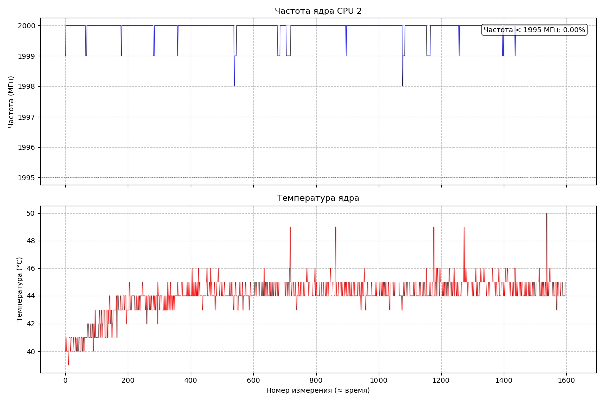
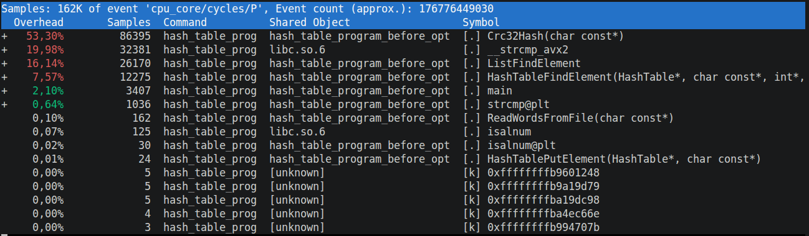
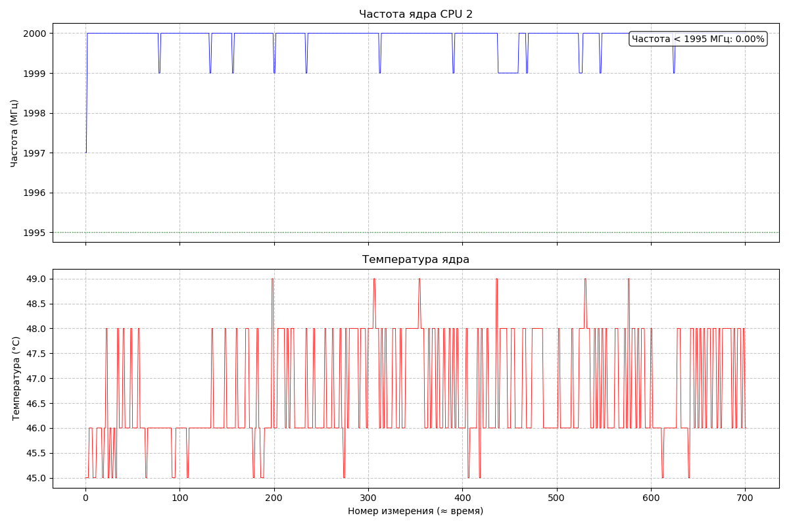
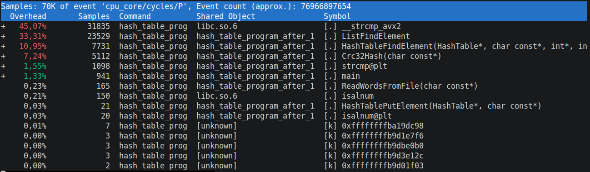
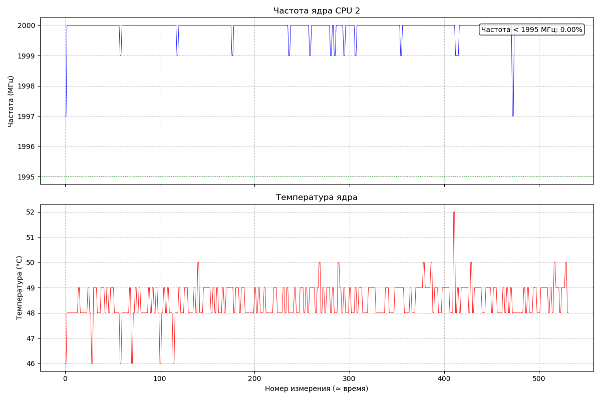
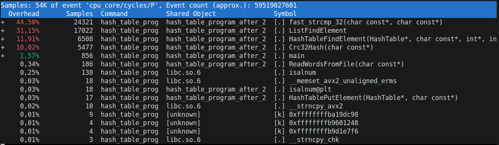
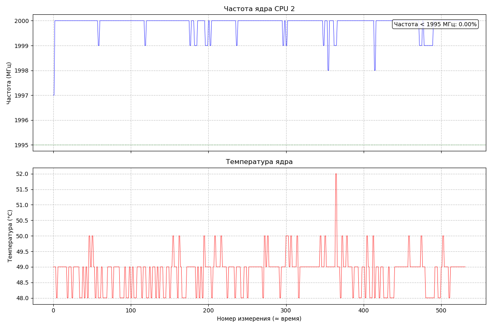
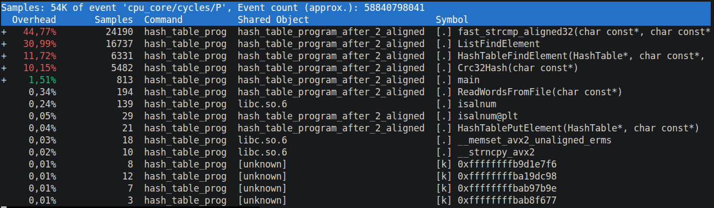
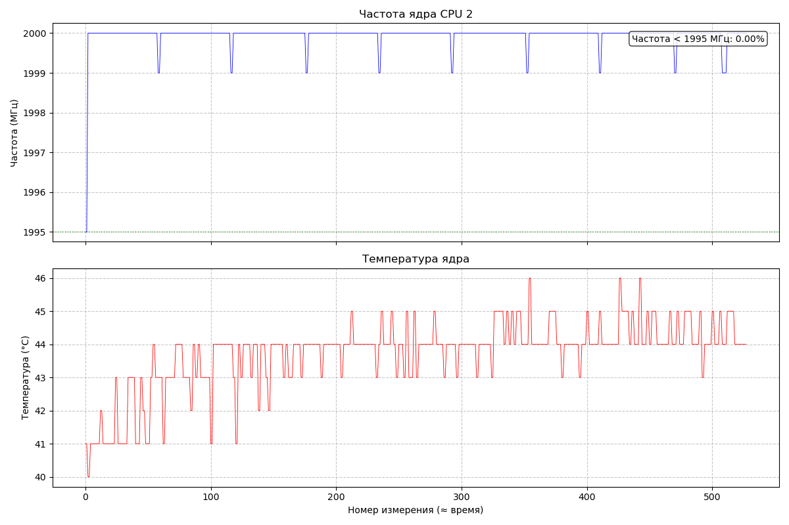

# Лабораторная работа по оптимизации поиска слов в хэш таблице.

### Аппаратное обеспечение
* **Процессор:** Intel® Core™ i-12540
* **Режим питания:** От сети

### Программная среда
* **Linux** Ubuntu 24.04.4 LTS
* **Компилятор:** g++ (Ubuntu 13.3.0-6ubuntu2~24.04.1) 13.3.0
* **Инструмент замера:** `hyperfine` (усреднение по 7 прогонам, 2 прогревочных цикла, в каждом прогоне 200 тестов поиска по 1000 слов из англоязычной версии произведения Л. Н. Толстого "Война и мир").
* **Мониторинг температуры ядер и троттлинга процессора:** turbostat
* **Используемый профиллировщик:** perf version 6.17.13

## 0. Версия программы до оптимизаций, компиляция с флагом -O2.

#### Benchmark 0: ./build/hash_table_program_before_opt  
**89.808 ± 0.136** с

#### perf анализ

## 1. Замена C-реализации функции вычисления хэша crc32 на intrinsic.

#### Benchmark 1: ./build/hash_table_program_after_1  
**39.107 ± 0.088** с

#### perf анализ

## 2. Замена strcmp из стандартной библиотеки на свою функцию.

#### Benchmark 2:  
**29.626 ± 0.161** с

#### perf анализ

Видим, что моя функция сравнения строк всё ещё остается узким горлышком в программе. Попробуем использовать векторную операцию для выровненных данных. Для этого нужно хранить слова в ячейках по 32 байта каждое.

## 2.1 Замена strcmp из стандартной библиотеки на свою функцию с соблюдением выравнивания.

#### Benchmark 2.1:  
**29.639 ± 0.067** с

Видим, что особой разницы нет. Функция сравнения уже работает быстро, а остается она узким горлышком только по той причине, что сравнений много. То есть это не проблема медленной функции, а в количестве вызовов этой функции. Поэтому перейдем к оптимизации функции, находящейся на втором месте.

#### perf анализ

## 3. Оптимизация ListFindElement чистым ассемблером

#### Benchmark 3:  
**29.385 ± 0.100** с

## Итоговое ускорение

Ускорение относительно исходной версии: **89.808 / 29.385 ≈ 3.06 раза**.