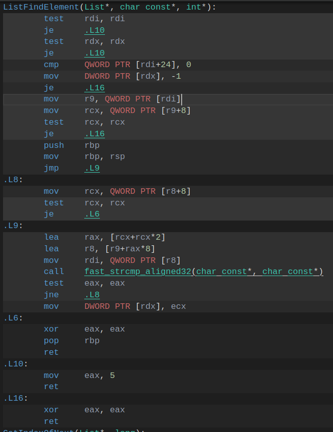

# Лабораторная работа по оптимизации поиска слов в хэш таблице.

### Аппаратное обеспечение
* **Процессор:** Intel® Core™ i-12540
* **Режим питания:** От сети

### Программная среда
* **Linux** Ubuntu 24.04.4 LTS
* **Компилятор:** g++ (Ubuntu 13.3.0-6ubuntu2~24.04.1) 13.3.0
* **Инструмент замера:** `hyperfine` (усреднение по 7 прогонам, 2 прогревочных цикла, в каждом прогоне 200 тестов поиска по 1000 слов из англоязычной версии произведения Л. Н. Толстого "Война и мир").
* **Мониторинг температуры ядер и троттлинга процессора:** turbostat
* **Используемый профиллировщик:** perf version 6.17.13

## 0. Версия программы до оптимизаций, компиляция с флагом -O2.

#### Benchmark 0: ./build/hash_table_program_before_opt  
**89.808 ± 0.136** с


#### perf анализ


## 1. Замена C-реализации функции вычисления хэша crc32 на intrinsic.
Было:
```c
uint64_t Crc32Hash(const char* key) 
{
    assert(key != NULL);

    uint32_t crc = 0xFFFFFFFF   ;

    while (*key)
    {
        crc ^= (uint8_t)(*key);

        for (int i = 0; i < 8; i++)
        {
            if (crc & 1)
                crc = (crc >> 1) ^ 0xEDB88320;
            else
                crc >>= 1;
        }
        key++;
    }

    return (uint64_t)~crc;
}
```
Стало:
```c
uint64_t Crc32Hash(const char* key) 
{
    uint32_t crc = 0xFFFFFFFF;   
    while (*key)
    {
        crc = _mm_crc32_u8(crc, (unsigned char)*key);
        key++;
    }
    return (uint64_t)(crc ^ 0xFFFFFFFF);
} 
```


#### Benchmark 1: ./build/hash_table_program_after_1  
**39.107 ± 0.088** с


#### perf анализ


Видим, что теперь узким горлышком в программе является функция сравнения строк из стандартной библиотеки. Эта функция уже достаточно оптимизирована, но мы всё равно можем ускорить её работу, используя знание нашего тест-кейса. Библиотечная функция написана для общего случая, а мы можем ограничиться частичным. Для этого будем использовать векторную инструкцию для быстрого сравнения строк. НО для этого нужно хранить слово в ячейках по 32 байта, то есть нам придётся ограничиться словами до 31 символа (+терминирующий нуль).В случае изменения тест-кейса можно просто в отдельном списке (даже не в хеш-таблице) хранить длинные слова, потому что их в целом существует не так много, и в случае, если такое длинное слово нужно будет найти, то можно будет пройти линейным поиском по списку и найти это слово. Таким образом, такое ограничение ради скорости нас вполне устраивает.

## 2. Замена strcmp из стандартной библиотеки на свою функцию.
Стало 
```c
static __attribute__((noinline)) int fast_strcmp_32(const char *a, const char *b) {
    int res = 0;
    __asm__ volatile (
        "vmovdqu ymm0, [%1]\n\t"          // невыровненная загрузка a
        "vpcmpeqb ymm1, ymm0, [%2]\n\t"   // невыровненное сравнение с b
        "vpmovmskb eax, ymm1\n\t"
        "xor eax, 0xffffffff\n\t"
        : "=a"(res)
        : "r"(a), "r"(b)
        : "ymm0", "ymm1"
    );
    return res;
}
```

#### Benchmark 2:  
**29.626 ± 0.161** с


#### perf анализ


Видим, что моя функция ускорила работу программы, но всё равно остаётся узким горлышком. Попробуем использовать ту же векторную инструкцию, но для выровненных данных (для этого нужно было изменить функцию чтения слов из файла так, чтобы она не просто сохраняла слова в ячейки по 32 байта, но ещё и соблюдала кратность адресов).


## 2.1 Замена strcmp из стандартной библиотеки на свою функцию с соблюдением выравнивания.
Было 
```c
static __attribute__((noinline)) int fast_strcmp_32(const char *a, const char *b) {
    int res = 0;
    __asm__ volatile (
        "vmovdqu ymm0, [%1]\n\t"          // невыровненная загрузка a
        "vpcmpeqb ymm1, ymm0, [%2]\n\t"   
        "vpmovmskb eax, ymm1\n\t"
        "xor eax, 0xffffffff\n\t"
        : "=a"(res)
        : "r"(a), "r"(b)
        : "ymm0", "ymm1"
    );
    return res;
}
```
Стало
```c
static __attribute__((noinline)) int fast_strcmp_aligned32(const char *a, const char *b) {
    int res = 0;
    __asm__ volatile (
        "vmovdqa ymm0, [%1]\n\t"          // выровненная загрузка a
        "vpcmpeqb ymm1, ymm0, [%2]\n\t"   
        "vpmovmskb eax, ymm1\n\t"         // бит = 1 если байты равны
        "xor eax, 0xffffffff\n\t"         // инвертируем: 1 там, где различие
        : "=a"(res)
        : "r"(a), "r"(b)
        : "ymm0", "ymm1"
    );
    return res;
}
```

#### Benchmark 2.1:  
**29.639 ± 0.067** с


Видим, что особой разницы нет. 
Функция сравнения уже работает быстро, а остается она узким горлышком только по той причине, что сравнений много. То есть проблема заключается не в медленной работе функции, а в количестве вызовов этой функции.Можно оптимизировать это изменением структуры данных, например, хранить в хэш таблице не просто указатель на строку, а ещё и посчитанный хэш (Номер ячейки - остаток от деления хэша на размер хэш таблицы, а тут именно 64-битный хэш). При сравнении строк мы сначала будем сравнивать хэш, и только в случае равенства хэшей будем сранивать строки. Но эта оптимизация использует изменение структуры данных и сильно влияет на логику проекта, поэтому оставим её на будущее и продолжим использовать низкоуровневые оптимизации для улучшения производительности текующей версии программы, не производя изменений в логике.
Поэтому перейдем к оптимизации функции, находящейся на втором месте в perf.

#### perf анализ


## 3. Оптимизация ListFindElement чистым ассемблером

Было:



Стало:
```s
section .text

global ListFindElement

ListFindElement:
    test    rdi, rdi
    je      .L6
    test    rdx, rdx
    je      .L6

    mov     dword [rdx], -1
    cmp     qword [rdi+24], 0
    je      .L3

    mov     r9, qword [rdi]          ; r9 = array
    mov     rcx, qword [r9+8]        ; head
    test    rcx, rcx
    je      .L3

    vmovdqa ymm2, [rsi]                  ; !!!вынос pattern (одна загрузка)

    ; начальный переход (как у компилятора)
    jmp     .L5

.L4:
    ; переход к следующему элементу
    mov     rcx, qword [r8+8]        ; r8 уже указывает на элемент
    test    rcx, rcx
    je      .L3

.L5:
    ; вычисление адреса элемента
    lea     rax, [rcx+rcx*2]
    lea     r8, [r9+rax*8]           ; r8 = &element
    mov     rdi, qword [r8]          ; rdi = element->data

    ; --- именно такой порядок, как у компилятора ---
    vmovdqa ymm0, [rdi]              ; загрузка данных элемента ;!!!!!!!!!!!!разбил одну операцию на две
    vpcmpeqb ymm1, ymm0, ymm2        ; сравнение с pattern
    vpmovmskb eax, ymm1
    inc eax
    ;;;xor     eax, 0xffffffff ;все байты равны <=> маска 0xFFFFFFFF. При прибавлении 1 к 0xFFFFFFFF получается 0x00000000 (переполнение) и флаг нуля ZF=1
    ;;;test    eax, eax
    ;;;jne     .L4
    jnz     .L4

    ; найдено
    mov     dword [rdx], ecx
.L3:
    xor     eax, eax
    ret

.L6:
    mov     eax, 5
    ret
```
- Вставил код фукнции fast_strcmp_aligned32 прямо внутрь оптимизируемой функции.
- Вынес из цикла загрузку из памяти искомого слова (получился инвариантый вынос кода [LICM])
- Заметил, что проверку eax на значение 0xffffffff можно сделать не через xor + test, а через inc eax, так как если eax = 0xffffffff, то при увеличении его на 1 произойдет переполнение, и флаг нуля ZF станет равным единице. Во всех остальных случаях при других значениях eax такая операция не выставит ZF в единицу.

#### Benchmark 3:  
**29.385 ± 0.100** с

 <br>

## Сводка
| Версия | Время (с) | Ускорение (коэффициент) |
|--------|----------|:-----------:|
| **0. before_opt** |89.808 ± 0.136 | 1.00 |
| 1. after_1 (CRC32 intrinsic) | 39.107 ± 0.088 | 2.30 |
| 2. after_2 (свой strcmp) | 29.626 ± 0.161 | 3.03 |
| 2.1 after_2_aligned | 29.639 ± 0.067 | 3.03 |
| **3. after_3 (ручной ассемблер)** | **29.385 ± 0.100** | **3.06** |

## Вывод
В ходе этой лабораторной работы я научился использовать 3 вида низкоуровневой оптимизации: интринсиком, ассемблерной вставкой и чистым ассемблером. 

### Интересные факты
В этой работе, как и в прошлой, мне нужно было фиксировать частоту ядра во избежание сильного нагрева и появления тротлинга. Прошлая работа была написана на Windows, и там даже при жестком фиксировании частоты наблюдались внезапные проседания частоты с 2.0 ГГц до 1.5 ГГц, а в этой работе, которая написана на Linux, фиксирование частоты работает гораздо лучше, присутствуют лишь небольше колебания с амплитудой < 5 МГц.